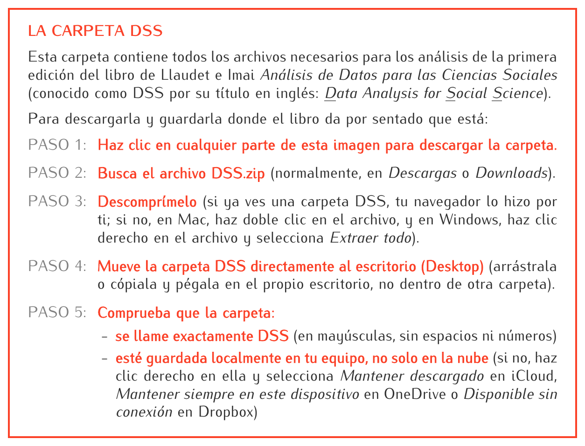

## Carpeta DSS: Datos y Código de *Análisis de Datos para las Ciencias Sociales* 
(Version Española de Llaudet e Imai's *Data Analysis for Social Science*, aka DSS)

(Si al hacer clic en la imagen no se descarga el archivo, usa este enlace: [DSS.zip](https://github.com/ellaudet/carpetaDSS/releases/latest/download/DSS.zip).)

<b>¿Qué contiene la carpeta DSS?</b> (haz clic para desplegar)

La carpeta DSS contiene los *scripts* de R (archivos .R) y los conjuntos de datos (archivos .csv) que se utilizan en Elena Llaudet y Kosuke Imai, *Análisis de Datos para las Ciencias Sociales: una introducción accesible y práctica* (Fondo de Cultura Económica, 202X), conocido como DSS por su título en inglés, *Data Analysis for Social Science*.

* Capítulo 1: Introducción
  * Objetivo: sentar las bases para los análisis de los capítulos siguientes
  * *Script* de R: Introduction.R
  * Conjunto de datos: STAR.csv

* Capítulo 2: Estimar efectos causales con experimentos aleatorizados
  * Pregunta de investigación: ¿Mejoran las clases pequeñas el rendimiento académico de los estudiantes?
  * Basado en: Frederick Mosteller, "The Tennessee Study of Class Size in the Early School Grades", *Future of Children*, vol. 5, núm. 2, 1995, pp. 113-127.
  * *Script* de R: Experimental.R
  * Conjunto de datos: STAR.csv

* Capítulo 3: Inferir las características de la población mediante encuestas
  * Pregunta de investigación: ¿Quiénes eran partidarios del Brexit?
  * Basado en: Sara B. Hobolt, "The Brexit Vote: A Divided Nation, a Divided Continent", *Journal of European Public Policy*, vol. 23, núm. 9, 2016, pp. 1259-1277, y Sascha O. Becker, Thiemo Fetzer y Dennis Novy, "Who Voted for Brexit? A Comprehensive District-Level Analysis", *Economic Policy*, vol. 32, núm. 92, 2017, pp. 601-650.
  * *Script* de R: Population.R
  * Conjuntos de datos: BES.csv, UK_districts.csv

* Capítulo 4: Predecir resultados utilizando la regresión lineal
  * Objetivo: predecir el crecimiento del PIB a partir de las emisiones nocturnas de luz
  * Basado en: J. Vernon Henderson, Adam Storeygard y David N. Weil, "Measuring Economic Growth from Outer Space", *American Economic Review*, vol. 102, núm. 2, 2012, pp. 994-1028.
  * *Script* de R: Prediction.R
  * Conjunto de datos: countries.csv

* Capítulo 5: Estimar efectos causales con datos observacionales
  * Pregunta de investigación: ¿Cuál fue el efecto de la propaganda de la televisión rusa sobre el comportamiento electoral de los ucranianos en 2014?
  * Basado en: Leonid Peisakhin y Arturas Rozenas, "Electoral Effects of Biased Media: Russian Television in Ukraine", *American Journal of Political Science*, vol. 62, núm. 3, 2018, pp. 535-550.
  * *Script* de R: Observational.R
  * Conjuntos de datos: UA_survey.csv, UA_precincts.csv

* Capítulo 6: Probabilidad
  * Objetivo: aprender los conceptos básicos de probabilidad
  * *Script* de R: Probability.R
  * Conjunto de datos: STAR.csv

* Capítulo 7: Cuantificar la incertidumbre
  * Objetivo: completar algunos de los análisis de los capítulos 2 al 5 cuantificando la incertidumbre de los resultados
  * *Script* de R: Uncertainty.R
  * Conjuntos de datos: BES.csv, STAR.csv, countries.csv, UA_survey.csv

